# Flask CI/CD Deployment with  Nginx & Gunicorn

This project demonstrates a complete **CI/CD pipeline** using GitHub Actions to deploy a Flask application on an EC2 server using **Gunicorn + Nginx**.

---

## Architecture

GitHub → GitHub Actions → EC2 → Gunicorn → Nginx → Browser


---

## Tech Stack

* Python (Flask)
* MongoDB
* Gunicorn
* Nginx
* GitHub Actions
* AWS EC2

---

## Project Structure

```
flask-app/
│── app.py
│── requirements.txt
│── .env
│── templates/
│── .github/workflows/deploy.yml
│── start_flask.sh
│── test_app.py
│── Jenkinsfile
```


---

## Environment Variables

Create `.env` file:

```
MONGO_URI=mongodb://localhost:27017/testdb
```


---

## Local Setup

```
git clone https://github.com/your-username/flask-app.git
cd flask-app

python3 -m venv venv
source venv/bin/activate

pip install -r requirements.txt
python3 app.py
```


---

## EC2 Setup

```
sudo apt update
sudo apt install python3-venv python3-pip nginx -y
```

---

## Gunicorn Setup

```
pip install gunicorn
gunicorn -w 3 -b 127.0.0.1:5000 app:app
```
---

## Systemd Service

Create file:

```
sudo nano /etc/systemd/system/flask-app.service
```

### Service Config

```
[Unit]
Description=Flask App
After=network.target

[Service]
User=ubuntu
WorkingDirectory=/var/www/flask-app
Environment="PATH=/var/www/flask-app/venv/bin"
ExecStart=/var/www/flask-app/venv/bin/gunicorn -w 3 -b 127.0.0.1:5000 app:app

[Install]
WantedBy=multi-user.target
```

### Start Service

```
sudo systemctl daemon-reload
sudo systemctl enable flask-app
sudo systemctl start flask-app
```


---

## 🌐 Nginx Configuration

```
sudo nano /etc/nginx/sites-available/flask-app
```

### Config

```
server {
    listen 80;

    location / {
        proxy_pass http://127.0.0.1:5000;
        proxy_set_header Host $host;
        proxy_set_header X-Real-IP $remote_addr;
    }
}
```

### Enable

```
sudo rm /etc/nginx/sites-enabled/default
sudo ln -s /etc/nginx/sites-available/flask-app /etc/nginx/sites-enabled

sudo nginx -t
sudo systemctl restart nginx
```


---

## CI/CD Pipeline

Location:

```
.github/workflows/deploy.yml
```

### Features

* Code linting (pylint)
* Security scan (bandit)
* Testing (pytest)
* Auto deployment via SSH
* Auto restart service


---

## GitHub Secrets

Add in **GitHub → Settings → Secrets**

* `STAGING_HOST`
* `STAGING_USER`
* `STAGING_SSH_KEY`
* `MONGO_URI`


---

## Deployment Flow

1. Push to `staging` branch
2. GitHub Actions runs CI
3. Deploys to EC2
4. Restarts Flask service
5. Nginx serves app


---

## Access App

```
http://<EC2-PUBLIC-IP>
```


---

## Common Issues

### 502 Bad Gateway

* Gunicorn not running

### Port already in use

```
sudo fuser -k 5000/tcp
```

### MongoDB Error

* Check `.env` file

---

## Final Output

✔ CI/CD fully automated
✔ Flask app deployed
✔ Nginx reverse proxy working

---

# Jenkins CI/CD Pipeline

## 🔹 Stages

- Install Dependencies
- Lint & Security (pylint + bandit)
- Run Tests (pytest)
- Deploy Staging (branch: staging)
- Deploy Production (branch: master)

---

## 🔐 Jenkins Credentials

| ID          | Type        |
|-------------|------------|
| staging-ssh | SSH Key     |
| prod-ssh    | SSH Key     |
| MONGO_URI   | Secret Text |
| STAGING_IP  | Secret Text |
| PROD_IP     | Secret Text |

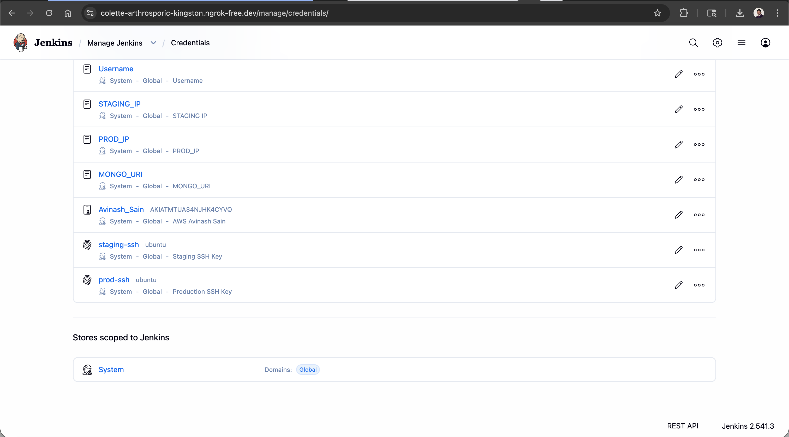

---

## 📸 Jenkins Screenshots

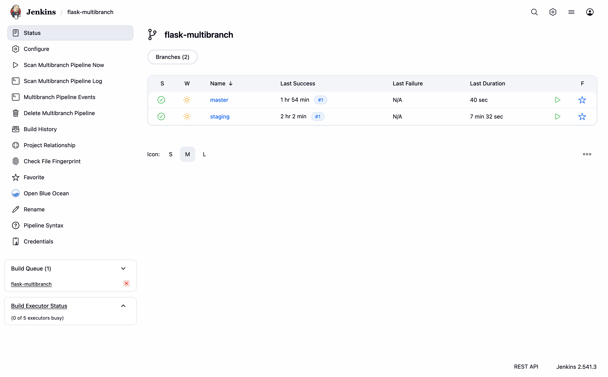  
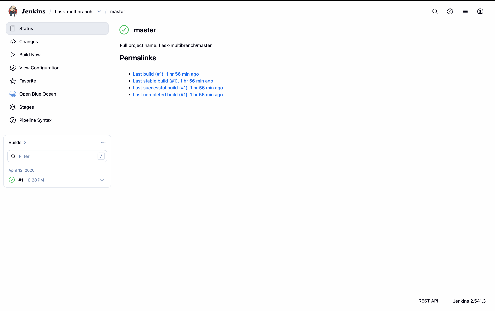  
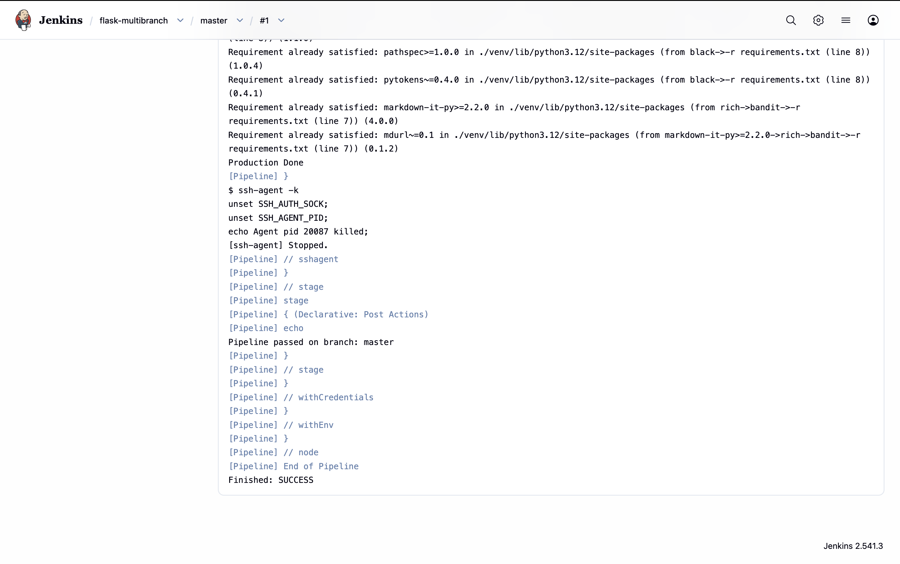  
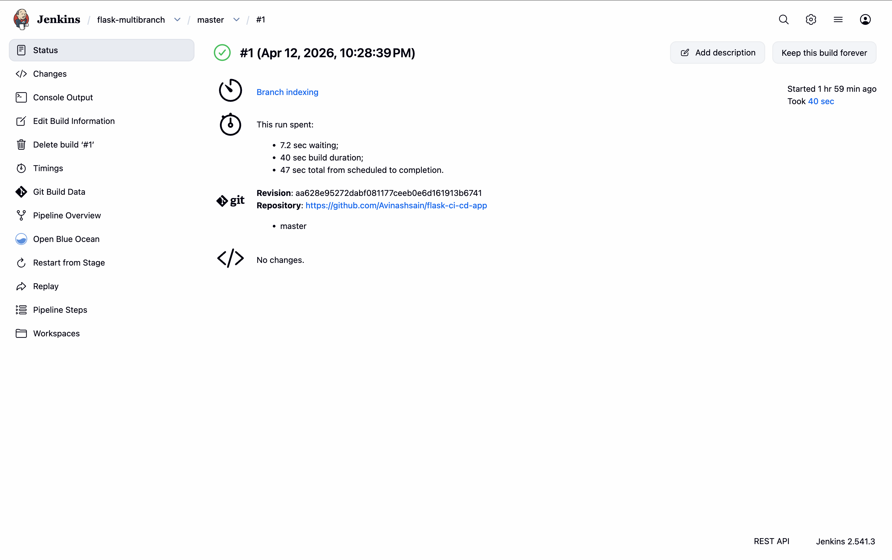
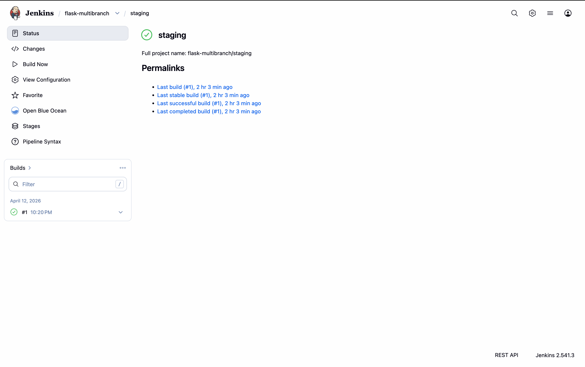  
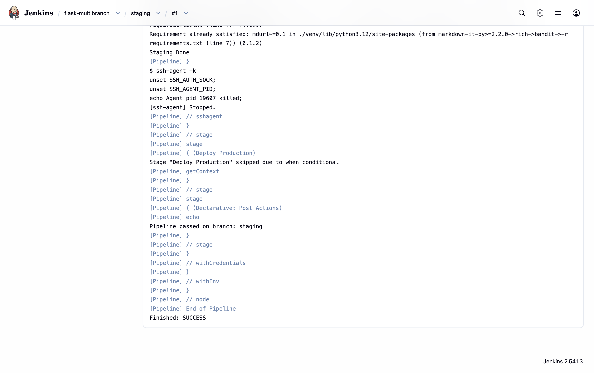  
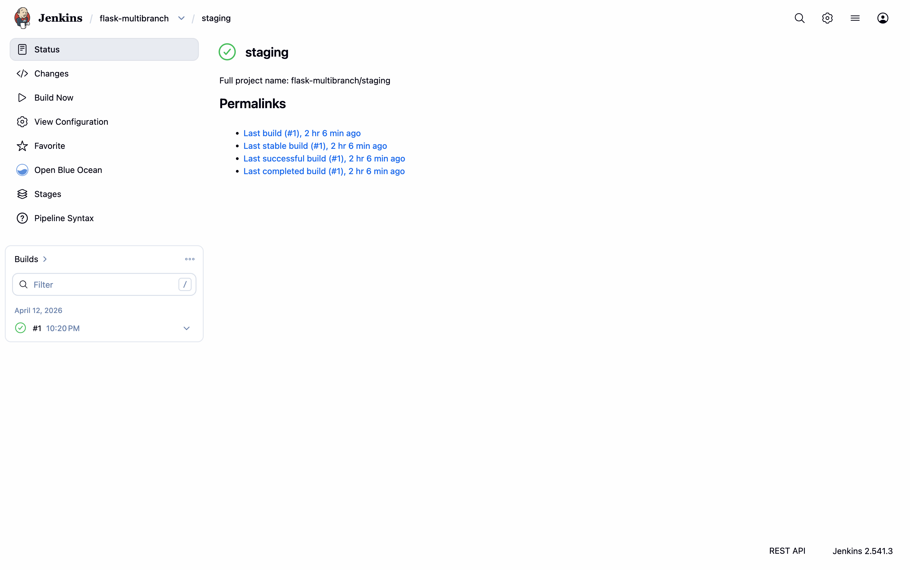
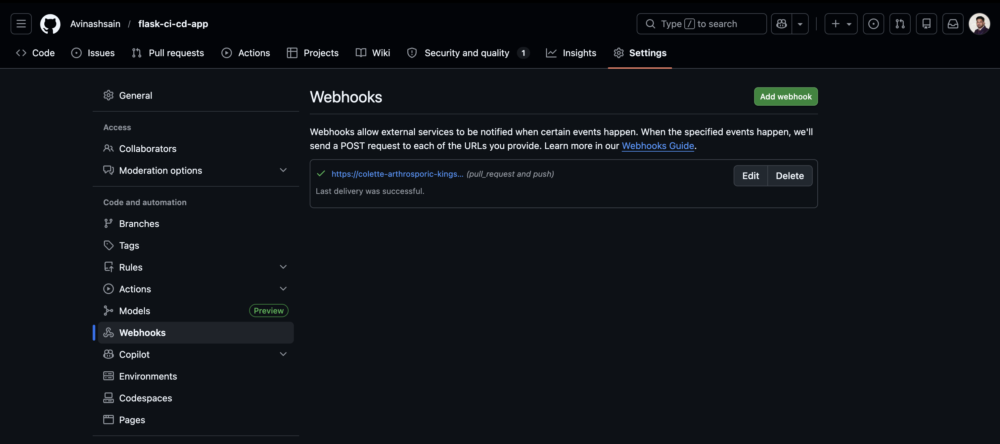  
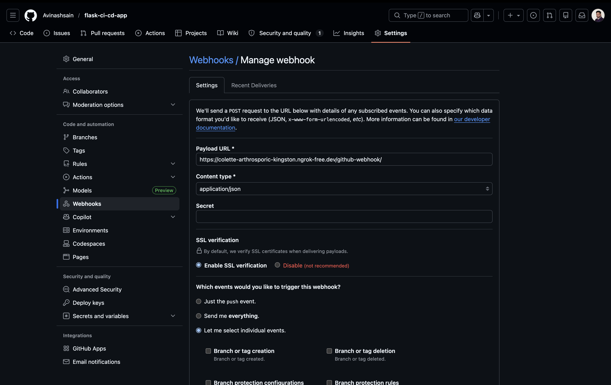
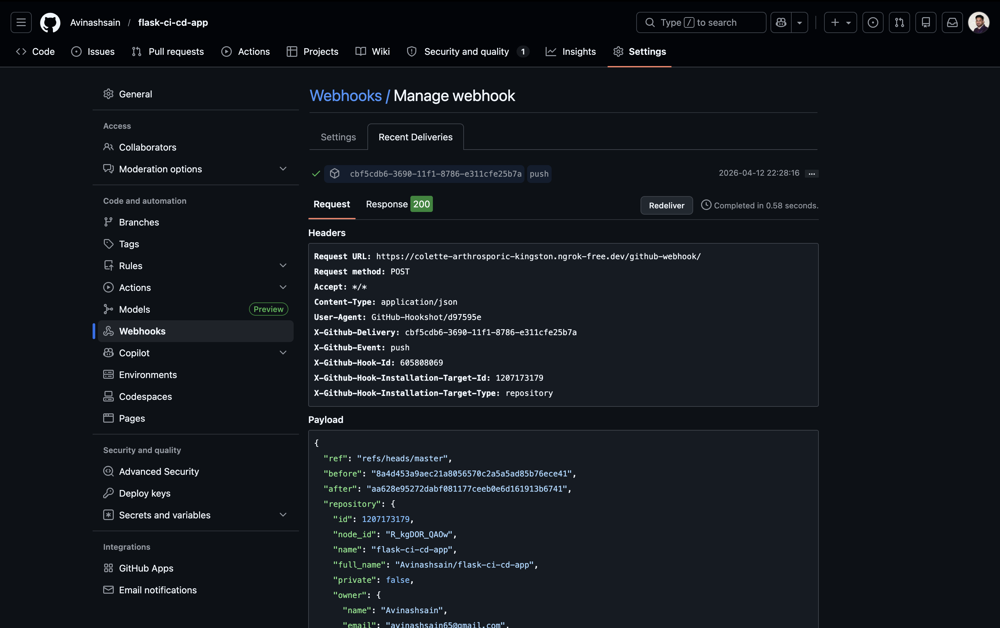

---

## Author

**Avinash Sain**